# ShohojRin — Database Schema & ER Diagram

> Trust-Based Verification & Loan Orchestration Platform

---

# Part 1 — Database Schema

## Entity Group Overview

| #   | Group               | Tables                                                            |
| --- | ------------------- | ----------------------------------------------------------------- |
| 1   | Authentication      | `users`, `login_sessions`                                         |
| 2   | User Information    | `user_profiles`, `institutions`                                   |
| 3   | Verification        | `verification_requests`, `verification_documents`, `guarantors`   |
| 4   | Trust Engine        | `trust_scores`, `trust_score_factors`                             |
| 5   | Loan Management     | `loan_applications`, `loan_offers`, `loans`, `loan_disbursements` |
| 6   | Repayment           | `repayment_schedules`, `repayments`                               |
| 7   | Partner Integration | `funding_partners`, `partner_rules`, `partner_decisions`          |
| 8   | Fraud               | `fraud_flags`                                                     |
| 9   | Audit               | `audit_logs`                                                      |
| 10  | Notification        | `notifications`                                                   |

**Total: 18 tables** — no junction tables required (all relationships are 1:1 or 1:N).

---

## 1 · Authentication

---

### 1.1 `users`

**Purpose** — Authentication identity. Contains _only_ credentials, system role, and account status. All profile data lives elsewhere.

| Column           | Type         | Constraints                    | Description                                        |
| ---------------- | ------------ | ------------------------------ | -------------------------------------------------- |
| `user_id`        | UUID         | **PK**                         | Unique user identifier                             |
| `email`          | VARCHAR(255) | UNIQUE, NOT NULL               | Login email address                                |
| `phone`          | VARCHAR(20)  | UNIQUE                         | Optional phone login                               |
| `password_hash`  | VARCHAR(255) | NOT NULL                       | Securely hashed password (bcrypt / argon2)         |
| `role`           | VARCHAR(20)  | NOT NULL, DEFAULT `'borrower'` | System role — `borrower`, `admin`, `partner_agent` |
| `account_status` | VARCHAR(20)  | NOT NULL, DEFAULT `'active'`   | `active`, `suspended`, `deactivated`               |
| `email_verified` | BOOLEAN      | NOT NULL, DEFAULT FALSE        | Whether email has been confirmed                   |
| `created_at`     | TIMESTAMPTZ  | NOT NULL, DEFAULT NOW()        | Registration timestamp                             |
| `updated_at`     | TIMESTAMPTZ  | NOT NULL, DEFAULT NOW()        | Last modification timestamp                        |

**Primary Key:** `user_id`
**Foreign Keys:** None
**Relationships:**

- 1 → 1 `user_profiles`
- 1 → N `login_sessions`
- 1 → N `verification_requests`
- 1 → N `trust_scores`
- 1 → N `loan_applications`
- 1 → N `fraud_flags`
- 1 → N `audit_logs`
- 1 → N `notifications`
- 1 → N `guarantors`

**Justification:** Authentication changes independently from profile data. Keeping this table lean improves security (fewer fields exposed during auth queries) and satisfies 3NF by separating credentials from biographical data.

---

### 1.2 `login_sessions`

**Purpose** — Active/revokable login sessions. Enables multi-device support, logout, and session revocation beyond JWT expiry.

| Column               | Type         | Constraints              | Description                      |
| -------------------- | ------------ | ------------------------ | -------------------------------- |
| `session_id`         | UUID         | **PK**                   | Unique session identifier        |
| `user_id`            | UUID         | **FK → users**, NOT NULL | Session owner                    |
| `refresh_token_hash` | VARCHAR(255) | NOT NULL                 | Hashed refresh token             |
| `ip_address`         | INET         |                          | Client IP at login               |
| `user_agent`         | TEXT         |                          | Browser/device string            |
| `is_revoked`         | BOOLEAN      | NOT NULL, DEFAULT FALSE  | Whether session has been revoked |
| `expires_at`         | TIMESTAMPTZ  | NOT NULL                 | Absolute session expiry          |
| `created_at`         | TIMESTAMPTZ  | NOT NULL, DEFAULT NOW()  | Session creation time            |

**Primary Key:** `session_id`
**Foreign Keys:** `user_id` → `users(user_id)`
**Relationships:** N → 1 `users`

**Justification:** Session management is a separate concern from authentication identity. Storing sessions enables server-side revocation, multi-device tracking, and suspicious-login auditing — none of which can be achieved with stateless JWTs alone.

---

## 2 · User Information

---

### 2.1 `institutions`

**Purpose** — Lookup table for universities, colleges, and organizations. Eliminates repeated institution names across thousands of user profiles.

| Column           | Type         | Constraints             | Description                                     |
| ---------------- | ------------ | ----------------------- | ----------------------------------------------- |
| `institution_id` | UUID         | **PK**                  | Unique institution identifier                   |
| `name`           | VARCHAR(255) | UNIQUE, NOT NULL        | Institution name (e.g., "BUET")                 |
| `type`           | VARCHAR(50)  | NOT NULL                | `university`, `college`, `vocational`, `other`  |
| `address`        | TEXT         |                         | Physical address                                |
| `is_verified`    | BOOLEAN      | NOT NULL, DEFAULT FALSE | Whether ShohojRin has verified this institution |
| `created_at`     | TIMESTAMPTZ  | NOT NULL, DEFAULT NOW() | Record creation                                 |

**Primary Key:** `institution_id`
**Foreign Keys:** None
**Relationships:** 1 → N `user_profiles`

**Justification:** Thousands of borrowers may attend the same institution. Storing the institution once and referencing it by FK satisfies 2NF/3NF and supports institution-level analytics (e.g., default rates per university).

---

### 2.2 `user_profiles`

**Purpose** — Borrower biographical and demographic data. Separated from `users` to keep authentication lean and allow future profile types.

| Column                  | Type          | Constraints                      | Description                                     |
| ----------------------- | ------------- | -------------------------------- | ----------------------------------------------- |
| `profile_id`            | UUID          | **PK**                           | Unique profile identifier                       |
| `user_id`               | UUID          | **FK → users**, UNIQUE, NOT NULL | One-to-one link to auth identity                |
| `full_name`             | VARCHAR(255)  | NOT NULL                         | Legal full name                                 |
| `date_of_birth`         | DATE          |                                  | Date of birth                                   |
| `gender`                | VARCHAR(20)   |                                  | `male`, `female`, `other`, `prefer_not_to_say`  |
| `nid_number`            | VARCHAR(50)   | UNIQUE                           | National ID number                              |
| `address_line`          | TEXT          |                                  | Street address                                  |
| `city`                  | VARCHAR(100)  |                                  | City/municipality                               |
| `district`              | VARCHAR(100)  |                                  | District                                        |
| `postal_code`           | VARCHAR(20)   |                                  | Postal code                                     |
| `occupation`            | VARCHAR(100)  |                                  | Current occupation / profession                 |
| `monthly_family_income` | DECIMAL(12,2) |                                  | Household income                                |
| `institution_id`        | UUID          | **FK → institutions**            | Current institution (nullable for non-students) |
| `student_id`            | VARCHAR(100)  |                                  | Student ID at institution                       |
| `enrollment_year`       | INTEGER       |                                  | Year of enrollment                              |
| `profile_photo_url`     | TEXT          |                                  | Path to profile photograph                      |
| `created_at`            | TIMESTAMPTZ   | NOT NULL, DEFAULT NOW()          | Profile creation                                |
| `updated_at`            | TIMESTAMPTZ   | NOT NULL, DEFAULT NOW()          | Last modification                               |

**Primary Key:** `profile_id`
**Foreign Keys:** `user_id` → `users(user_id)`, `institution_id` → `institutions(institution_id)`
**Relationships:**

- 1 → 1 `users`
- N → 1 `institutions`

**Justification:** Profile data changes independently from auth credentials and at a different frequency. Splitting them avoids a bloated users table and satisfies 3NF — `institution_id` removes the transitive dependency that would exist if institution details were stored inline.

---

## 3 · Verification

---

### 3.1 `verification_requests`

**Purpose** — Represents one verification _process_ (workflow), not a boolean flag. Supports verify, re-verify, appeal, and full history.

| Column              | Type        | Constraints                   | Description                                             |
| ------------------- | ----------- | ----------------------------- | ------------------------------------------------------- |
| `request_id`        | UUID        | **PK**                        | Unique request identifier                               |
| `user_id`           | UUID        | **FK → users**, NOT NULL      | Borrower requesting verification                        |
| `verification_type` | VARCHAR(50) | NOT NULL                      | `identity`, `student`, `income`, `address`, `guarantor` |
| `status`            | VARCHAR(20) | NOT NULL, DEFAULT `'pending'` | `pending`, `approved`, `rejected`, `needs_review`       |
| `reviewer_id`       | UUID        | **FK → users**                | Admin who reviewed (nullable while pending)             |
| `reviewer_notes`    | TEXT        |                               | Admin notes / rejection reason                          |
| `submitted_at`      | TIMESTAMPTZ | NOT NULL, DEFAULT NOW()       | Submission timestamp                                    |
| `reviewed_at`       | TIMESTAMPTZ |                               | Review completion timestamp                             |

**Primary Key:** `request_id`
**Foreign Keys:** `user_id` → `users(user_id)`, `reviewer_id` → `users(user_id)`
**Relationships:**

- N → 1 `users` (borrower)
- N → 1 `users` (reviewer)
- 1 → N `verification_documents`

**Justification:** Verification is a _process_, not a property of the user. Users may have multiple verification attempts (initial, re-verification, appeal). A separate table preserves the full history and decouples workflow from identity.

---

### 3.2 `verification_documents`

**Purpose** — Individual documents uploaded as part of a verification request. Supports multiple documents per request and future OCR / AI validation.

| Column          | Type         | Constraints                              | Description                                                                     |
| --------------- | ------------ | ---------------------------------------- | ------------------------------------------------------------------------------- |
| `document_id`   | UUID         | **PK**                                   | Unique document identifier                                                      |
| `request_id`    | UUID         | **FK → verification_requests**, NOT NULL | Parent verification request                                                     |
| `document_type` | VARCHAR(50)  | NOT NULL                                 | `nid`, `student_id`, `tuition_receipt`, `utility_bill`, `income_proof`, `other` |
| `file_url`      | TEXT         | NOT NULL                                 | Storage path / URL                                                              |
| `file_name`     | VARCHAR(255) |                                          | Original filename                                                               |
| `mime_type`     | VARCHAR(100) |                                          | e.g., `application/pdf`, `image/jpeg`                                           |
| `uploaded_at`   | TIMESTAMPTZ  | NOT NULL, DEFAULT NOW()                  | Upload timestamp                                                                |

**Primary Key:** `document_id`
**Foreign Keys:** `request_id` → `verification_requests(request_id)`
**Relationships:** N → 1 `verification_requests`

**Justification:** One verification request may require multiple documents (NID + student ID + tuition receipt). Storing documents separately enables per-document replacement, OCR processing, and AI-based validation without modifying the parent request.

---

### 3.3 `guarantors`

**Purpose** — Stores guarantor / reference information linked to a borrower. Supports changing and multiple guarantors over time.

| Column         | Type         | Constraints              | Description                                                      |
| -------------- | ------------ | ------------------------ | ---------------------------------------------------------------- |
| `guarantor_id` | UUID         | **PK**                   | Unique guarantor record                                          |
| `user_id`      | UUID         | **FK → users**, NOT NULL | Borrower who listed this guarantor                               |
| `full_name`    | VARCHAR(255) | NOT NULL                 | Guarantor's full name                                            |
| `relationship` | VARCHAR(100) | NOT NULL                 | Relationship to borrower (e.g., `parent`, `employer`, `teacher`) |
| `phone`        | VARCHAR(20)  |                          | Guarantor phone                                                  |
| `email`        | VARCHAR(255) |                          | Guarantor email                                                  |
| `nid_number`   | VARCHAR(50)  |                          | Guarantor NID                                                    |
| `address`      | TEXT         |                          | Guarantor address                                                |
| `is_verified`  | BOOLEAN      | NOT NULL, DEFAULT FALSE  | Whether guarantor has been verified                              |
| `created_at`   | TIMESTAMPTZ  | NOT NULL, DEFAULT NOW()  | Record creation                                                  |

**Primary Key:** `guarantor_id`
**Foreign Keys:** `user_id` → `users(user_id)`
**Relationships:** N → 1 `users`

**Justification:** Guarantors are independent entities from the borrower profile. A borrower may change guarantors or have multiple guarantors across different loans. Separating this enables guarantor verification workflows and historical tracking.

---

## 4 · Trust Engine

---

### 4.1 `trust_scores`

**Purpose** — Immutable snapshots of a borrower's calculated trust score. Every recalculation creates a new row — history is never overwritten.

| Column             | Type         | Constraints              | Description                                                                                                                       |
| ------------------ | ------------ | ------------------------ | --------------------------------------------------------------------------------------------------------------------------------- |
| `score_id`         | UUID         | **PK**                   | Unique score snapshot identifier                                                                                                  |
| `user_id`          | UUID         | **FK → users**, NOT NULL | Borrower this score belongs to                                                                                                    |
| `score`            | DECIMAL(5,2) | NOT NULL                 | Numeric trust score (0–100)                                                                                                       |
| `trust_band`       | VARCHAR(20)  | NOT NULL                 | `very_low_risk` (80-100), `low_risk` (65-79.99), `moderate_risk` (50-64.99), `high_risk` (35-49.99), `very_high_risk` (0-34.99)   |
| `confidence_score` | DECIMAL(5,2) |                          | Evidence confidence score (0–100)                                                                                                 |
| `trigger_event`    | VARCHAR(100) | NOT NULL                 | What triggered this recalculation (e.g., `verification_approved`, `repayment_received`, `loan_disbursed`, `manual_recalculation`) |
| `is_current`       | BOOLEAN      | NOT NULL, DEFAULT TRUE   | Whether this is the latest score                                                                                                  |
| `calculated_at`    | TIMESTAMPTZ  | NOT NULL, DEFAULT NOW()  | Calculation timestamp                                                                                                             |

**Primary Key:** `score_id`
**Foreign Keys:** `user_id` → `users(user_id)`
**Relationships:**

- N → 1 `users`
- 1 → N `trust_score_factors`

**Justification:** The spec explicitly requires that trust scores _never_ be overwritten. Each calculation is a snapshot that preserves trend analysis, explainability, and audit capability. The `is_current` flag provides fast access to the latest score without a subquery.

---

### 4.2 `trust_score_factors`

**Purpose** — Explains the 5 component scores contributing to the composite trust score.

| Column          | Type         | Constraints                     | Description                                                                                                                  |
| --------------- | ------------ | ------------------------------- | ---------------------------------------------------------------------------------------------------------------------------- |
| `factor_id`     | UUID         | **PK**                          | Unique factor identifier                                                                                                     |
| `score_id`      | UUID         | **FK → trust_scores**, NOT NULL | Parent score snapshot                                                                                                        |
| `factor_name`   | VARCHAR(100) | NOT NULL                        | Component name (`repayment_history`, `financial_capacity`, `financial_behavior`, `identity_verification`, `credit_behavior`) |
| `factor_value`  | DECIMAL(6,2) | NOT NULL                        | Component score (0–100)                                                                                                      |
| `factor_weight` | DECIMAL(3,2) |                                 | Component weight (0.35, 0.25, 0.15, 0.15, 0.10)                                                                              |
| `description`   | TEXT         |                                 | Detailed explanation                                                                                                         |

**Primary Key:** `factor_id`
**Foreign Keys:** `score_id` → `trust_scores(score_id)`
**Relationships:** N → 1 `trust_scores`

**Justification:** The spec mandates _explainable_ trust scoring. Evaluators must understand why a borrower received a score of 72, not just see "72". Factors tied to each score snapshot provide transparency, auditability, and fairness verification.

---

## 5 · Loan Management

---

### 5.1 `loan_applications`

**Purpose** — A borrower's _request_ for a loan. May be rejected, withdrawn, or approved — it is not a loan until approved and disbursed.

| Column                | Type          | Constraints                 | Description                                                                                                              |
| --------------------- | ------------- | --------------------------- | ------------------------------------------------------------------------------------------------------------------------ |
| `application_id`      | UUID          | **PK**                      | Unique application identifier                                                                                            |
| `user_id`             | UUID          | **FK → users**, NOT NULL    | Applicant                                                                                                                |
| `partner_id`          | UUID          | **FK → funding_partners**   | Targeted partner (nullable for platform-matched)                                                                         |
| `requested_amount`    | DECIMAL(12,2) | NOT NULL                    | Amount requested                                                                                                         |
| `purpose`             | VARCHAR(100)  | NOT NULL                    | Loan purpose (`tuition`, `device`, `medical`, `business`, `other`)                                                       |
| `purpose_description` | TEXT          |                             | Detailed purpose narrative                                                                                               |
| `status`              | VARCHAR(20)   | NOT NULL, DEFAULT `'draft'` | `draft`, `submitted`, `under_review`, `approved`, `rejected`, `disbursed`, `active`, `completed`, `overdue`, `defaulted` |
| `trust_score_id`      | UUID          | **FK → trust_scores**       | Trust score snapshot at time of application                                                                              |
| `submitted_at`        | TIMESTAMPTZ   |                             | Submission timestamp                                                                                                     |
| `created_at`          | TIMESTAMPTZ   | NOT NULL, DEFAULT NOW()     | Draft creation time                                                                                                      |
| `updated_at`          | TIMESTAMPTZ   | NOT NULL, DEFAULT NOW()     | Last status change                                                                                                       |

**Primary Key:** `application_id`
**Foreign Keys:** `user_id` → `users(user_id)`, `partner_id` → `funding_partners(partner_id)`, `trust_score_id` → `trust_scores(score_id)`
**Relationships:**

- N → 1 `users`
- N → 1 `funding_partners`
- N → 1 `trust_scores`
- 1 → 0..1 `loan_offers`
- 1 → 0..1 `loans`
- 1 → N `partner_decisions`

**Justification:** An application is a _request_, not a loan. Many applications will never become loans (rejected, withdrawn). Separating them preserves the complete application history and prevents the loans table from containing non-loan records.

---

### 5.2 `loan_offers`

**Purpose** — A partner's counter-offer to an application. The offered terms may differ from what the borrower requested.

| Column           | Type          | Constraints                                  | Description                                  |
| ---------------- | ------------- | -------------------------------------------- | -------------------------------------------- |
| `offer_id`       | UUID          | **PK**                                       | Unique offer identifier                      |
| `application_id` | UUID          | **FK → loan_applications**, UNIQUE, NOT NULL | The application this offer responds to       |
| `partner_id`     | UUID          | **FK → funding_partners**, NOT NULL          | Partner making the offer                     |
| `offered_amount` | DECIMAL(12,2) | NOT NULL                                     | Amount offered (may differ from requested)   |
| `interest_rate`  | DECIMAL(5,2)  | NOT NULL                                     | Annual interest rate (%)                     |
| `tenure_months`  | INTEGER       | NOT NULL                                     | Repayment period in months                   |
| `conditions`     | TEXT          |                                              | Special conditions or stipulations           |
| `status`         | VARCHAR(20)   | NOT NULL, DEFAULT `'pending'`                | `pending`, `accepted`, `declined`, `expired` |
| `offered_at`     | TIMESTAMPTZ   | NOT NULL, DEFAULT NOW()                      | Offer creation timestamp                     |
| `expires_at`     | TIMESTAMPTZ   |                                              | Offer expiry                                 |
| `responded_at`   | TIMESTAMPTZ   |                                              | Borrower response timestamp                  |

**Primary Key:** `offer_id`
**Foreign Keys:** `application_id` → `loan_applications(application_id)`, `partner_id` → `funding_partners(partner_id)`
**Relationships:**

- 1 → 1 `loan_applications`
- N → 1 `funding_partners`

**Justification:** The spec explicitly states that a partner may approve a different amount than requested ("30,000 instead of requested 50,000"). Modifying the original application would violate historical integrity. A separate offer table preserves both the original request and the partner's counter-terms.

---

### 5.3 `loans`

**Purpose** — An active, approved loan. Exists only after an application has been approved and an offer accepted.

| Column              | Type          | Constraints                                  | Description                                                 |
| ------------------- | ------------- | -------------------------------------------- | ----------------------------------------------------------- |
| `loan_id`           | UUID          | **PK**                                       | Unique loan identifier                                      |
| `application_id`    | UUID          | **FK → loan_applications**, UNIQUE, NOT NULL | Originating application                                     |
| `offer_id`          | UUID          | **FK → loan_offers**, UNIQUE, NOT NULL       | Accepted offer with final terms                             |
| `user_id`           | UUID          | **FK → users**, NOT NULL                     | Borrower                                                    |
| `partner_id`        | UUID          | **FK → funding_partners**, NOT NULL          | Lending partner                                             |
| `principal_amount`  | DECIMAL(12,2) | NOT NULL                                     | Disbursed principal                                         |
| `interest_rate`     | DECIMAL(5,2)  | NOT NULL                                     | Locked-in annual interest rate                              |
| `tenure_months`     | INTEGER       | NOT NULL                                     | Locked-in repayment period                                  |
| `status`            | VARCHAR(20)   | NOT NULL, DEFAULT `'active'`                 | `active`, `completed`, `overdue`, `delinquent`, `defaulted` |
| `start_date`        | DATE          | NOT NULL                                     | Loan start date                                             |
| `expected_end_date` | DATE          | NOT NULL                                     | Expected completion date                                    |
| `created_at`        | TIMESTAMPTZ   | NOT NULL, DEFAULT NOW()                      | Record creation                                             |
| `updated_at`        | TIMESTAMPTZ   | NOT NULL, DEFAULT NOW()                      | Last status update                                          |

**Primary Key:** `loan_id`
**Foreign Keys:** `application_id` → `loan_applications(application_id)`, `offer_id` → `loan_offers(offer_id)`, `user_id` → `users(user_id)`, `partner_id` → `funding_partners(partner_id)`
**Relationships:**

- 1 → 1 `loan_applications`
- 1 → 1 `loan_offers`
- N → 1 `users`
- N → 1 `funding_partners`
- 1 → N `loan_disbursements`
- 1 → N `repayment_schedules`

**Justification:** A loan is an entity that exists _only after approval_. Applications exist before approval. Combining them would mix two lifecycle stages and make status management, repayment tracking, and disbursement linkage unnecessarily complex.

---

### 5.4 `loan_disbursements`

**Purpose** — Records actual money transfers. Loan approval ≠ money transferred. Supports multiple disbursement tranches per loan.

| Column                | Type          | Constraints              | Description                                        |
| --------------------- | ------------- | ------------------------ | -------------------------------------------------- |
| `disbursement_id`     | UUID          | **PK**                   | Unique disbursement identifier                     |
| `loan_id`             | UUID          | **FK → loans**, NOT NULL | Parent loan                                        |
| `amount`              | DECIMAL(12,2) | NOT NULL                 | Disbursed amount                                   |
| `disbursement_method` | VARCHAR(50)   |                          | `bank_transfer`, `mobile_money`, `cheque`, `other` |
| `reference_number`    | VARCHAR(100)  |                          | Transaction reference                              |
| `disbursed_at`        | TIMESTAMPTZ   | NOT NULL, DEFAULT NOW()  | Disbursement timestamp                             |

**Primary Key:** `disbursement_id`
**Foreign Keys:** `loan_id` → `loans(loan_id)`
**Relationships:** N → 1 `loans`

**Justification:** The spec states "Loan approval ≠ Money transferred" and "one loan may have multiple disbursements." Tracking disbursements separately provides a financial audit trail and supports partial/tranche-based disbursement models.

---

## 6 · Repayment

---

### 6.1 `repayment_schedules`

**Purpose** — Expected installments. The _plan_ for repayment, separate from actual payments received.

| Column               | Type          | Constraints                   | Description                                                 |
| -------------------- | ------------- | ----------------------------- | ----------------------------------------------------------- |
| `schedule_id`        | UUID          | **PK**                        | Unique schedule entry identifier                            |
| `loan_id`            | UUID          | **FK → loans**, NOT NULL      | Parent loan                                                 |
| `installment_number` | INTEGER       | NOT NULL                      | Sequence number (1, 2, 3…)                                  |
| `due_date`           | DATE          | NOT NULL                      | Expected payment date                                       |
| `expected_amount`    | DECIMAL(12,2) | NOT NULL                      | Expected installment amount                                 |
| `status`             | VARCHAR(20)   | NOT NULL, DEFAULT `'pending'` | `pending`, `paid`, `partially_paid`, `overdue`, `defaulted` |
| `created_at`         | TIMESTAMPTZ   | NOT NULL, DEFAULT NOW()       | Record creation                                             |

**Primary Key:** `schedule_id`
**Foreign Keys:** `loan_id` → `loans(loan_id)`
**Unique Constraint:** (`loan_id`, `installment_number`)
**Relationships:**

- N → 1 `loans`
- 1 → N `repayments`

**Justification:** Expected payments are not actual payments. The schedule defines the _plan_; actual payments may be partial, late, or failed. Separating them enables overdue detection, repayment performance analytics, and trust score recalculation triggers.

---

### 6.2 `repayments`

**Purpose** — Actual payments received against a scheduled installment. Never overwritten — supports partial payments, failed payments, and full history.

| Column                  | Type          | Constraints                            | Description                                      |
| ----------------------- | ------------- | -------------------------------------- | ------------------------------------------------ |
| `repayment_id`          | UUID          | **PK**                                 | Unique repayment record                          |
| `schedule_id`           | UUID          | **FK → repayment_schedules**, NOT NULL | Target installment                               |
| `amount_paid`           | DECIMAL(12,2) | NOT NULL                               | Actual amount paid                               |
| `payment_method`        | VARCHAR(50)   |                                        | `bank_transfer`, `mobile_money`, `cash`, `other` |
| `transaction_reference` | VARCHAR(100)  |                                        | External transaction reference                   |
| `status`                | VARCHAR(20)   | NOT NULL, DEFAULT `'completed'`        | `completed`, `failed`, `reversed`                |
| `paid_at`               | TIMESTAMPTZ   | NOT NULL, DEFAULT NOW()                | Payment timestamp                                |

**Primary Key:** `repayment_id`
**Foreign Keys:** `schedule_id` → `repayment_schedules(schedule_id)`
**Relationships:** N → 1 `repayment_schedules`

**Justification:** Actual payment events must be recorded immutably. A single installment may receive multiple partial payments or have a failed attempt followed by a successful one. This design preserves the complete financial history required for audit and compliance.

---

## 7 · Partner Integration

---

### 7.1 `funding_partners`

**Purpose** — Represents partner lending organizations (banks, NGOs, MFIs, alumni funds). Adding a new partner requires no schema change.

| Column          | Type         | Constraints             | Description                                  |
| --------------- | ------------ | ----------------------- | -------------------------------------------- |
| `partner_id`    | UUID         | **PK**                  | Unique partner identifier                    |
| `name`          | VARCHAR(255) | UNIQUE, NOT NULL        | Organization name                            |
| `type`          | VARCHAR(50)  | NOT NULL                | `bank`, `ngo`, `mfi`, `alumni_fund`, `other` |
| `contact_email` | VARCHAR(255) |                         | Primary contact email                        |
| `contact_phone` | VARCHAR(20)  |                         | Primary contact phone                        |
| `is_active`     | BOOLEAN      | NOT NULL, DEFAULT TRUE  | Whether partner is currently active          |
| `created_at`    | TIMESTAMPTZ  | NOT NULL, DEFAULT NOW() | Onboarding timestamp                         |
| `updated_at`    | TIMESTAMPTZ  | NOT NULL, DEFAULT NOW() | Last modification                            |

**Primary Key:** `partner_id`
**Foreign Keys:** None
**Relationships:**

- 1 → N `partner_rules`
- 1 → N `partner_decisions`
- 1 → N `loan_applications`
- 1 → N `loan_offers`
- 1 → N `loans`

**Justification:** Partners are first-class entities in the business domain. Normalizing them into their own table avoids repeating partner details across loan applications and decisions, and ensures new partner types can be added without schema redesign.

---

### 7.2 `partner_rules`

**Purpose** — Configurable lending criteria defined by each partner. Rules are data, not hardcoded logic.

| Column              | Type          | Constraints                         | Description                               |
| ------------------- | ------------- | ----------------------------------- | ----------------------------------------- |
| `rule_id`           | UUID          | **PK**                              | Unique rule identifier                    |
| `partner_id`        | UUID          | **FK → funding_partners**, NOT NULL | Owning partner                            |
| `min_trust_score`   | DECIMAL(5,2)  |                                     | Minimum required trust score              |
| `max_loan_amount`   | DECIMAL(12,2) |                                     | Maximum loan amount offered               |
| `max_tenure_months` | INTEGER       |                                     | Maximum repayment tenure                  |
| `eligible_purposes` | TEXT[]        |                                     | Array of eligible loan purposes           |
| `is_active`         | BOOLEAN       | NOT NULL, DEFAULT TRUE              | Whether this rule set is currently active |
| `effective_from`    | TIMESTAMPTZ   | NOT NULL, DEFAULT NOW()             | Rule effective start date                 |
| `effective_until`   | TIMESTAMPTZ   |                                     | Rule expiry (nullable = open-ended)       |
| `created_at`        | TIMESTAMPTZ   | NOT NULL, DEFAULT NOW()             | Record creation                           |

**Primary Key:** `rule_id`
**Foreign Keys:** `partner_id` → `funding_partners(partner_id)`
**Relationships:** N → 1 `funding_partners`

**Justification:** Partner lending criteria change over time and must not be hardcoded. Storing rules as data enables the `partnerEligibilityCheck()` function, supports effective-dating for rule versioning, and allows different partners to have completely different criteria.

---

### 7.3 `partner_decisions`

**Purpose** — Records a partner's evaluation of a loan application. Application ≠ Decision — a partner may approve, reject, or request manual review.

| Column           | Type        | Constraints                          | Description                                                            |
| ---------------- | ----------- | ------------------------------------ | ---------------------------------------------------------------------- |
| `decision_id`    | UUID        | **PK**                               | Unique decision identifier                                             |
| `application_id` | UUID        | **FK → loan_applications**, NOT NULL | Evaluated application                                                  |
| `partner_id`     | UUID        | **FK → funding_partners**, NOT NULL  | Evaluating partner                                                     |
| `decision`       | VARCHAR(20) | NOT NULL                             | `approved`, `rejected`, `manual_review`                                |
| `reason`         | TEXT        |                                      | Decision rationale                                                     |
| `decided_by`     | UUID        | **FK → users**                       | Partner agent who made the decision (nullable for automated decisions) |
| `decided_at`     | TIMESTAMPTZ | NOT NULL, DEFAULT NOW()              | Decision timestamp                                                     |

**Primary Key:** `decision_id`
**Foreign Keys:** `application_id` → `loan_applications(application_id)`, `partner_id` → `funding_partners(partner_id)`, `decided_by` → `users(user_id)`
**Relationships:**

- N → 1 `loan_applications`
- N → 1 `funding_partners`
- N → 1 `users` (decision maker)

**Justification:** Decisions are separate events from applications. A single application may receive multiple decisions (from different partners, or after re-evaluation). Preserving decision history supports audit compliance and partner performance analytics.

---

## 8 · Fraud

---

### 8.1 `fraud_flags`

**Purpose** — Records suspicious activity events. Fraud flags are event-based and never automatically deleted.

| Column             | Type         | Constraints                | Description                                                                                                           |
| ------------------ | ------------ | -------------------------- | --------------------------------------------------------------------------------------------------------------------- |
| `flag_id`          | UUID         | **PK**                     | Unique flag identifier                                                                                                |
| `user_id`          | UUID         | **FK → users**, NOT NULL   | Flagged user                                                                                                          |
| `flag_type`        | VARCHAR(100) | NOT NULL                   | `duplicate_identity`, `repeated_failed_verification`, `multiple_accounts`, `document_mismatch`, `suspicious_behavior` |
| `severity`         | VARCHAR(20)  | NOT NULL                   | `low`, `medium`, `high`, `critical`                                                                                   |
| `description`      | TEXT         |                            | Detailed description of suspicious activity                                                                           |
| `status`           | VARCHAR(20)  | NOT NULL, DEFAULT `'open'` | `open`, `under_review`, `resolved`, `dismissed`                                                                       |
| `reviewed_by`      | UUID         | **FK → users**             | Admin who reviewed the flag                                                                                           |
| `resolution_notes` | TEXT         |                            | Admin resolution notes                                                                                                |
| `flagged_at`       | TIMESTAMPTZ  | NOT NULL, DEFAULT NOW()    | Flag creation timestamp                                                                                               |
| `resolved_at`      | TIMESTAMPTZ  |                            | Resolution timestamp                                                                                                  |

**Primary Key:** `flag_id`
**Foreign Keys:** `user_id` → `users(user_id)`, `reviewed_by` → `users(user_id)`
**Relationships:**

- N → 1 `users` (flagged user)
- N → 1 `users` (reviewer)

**Justification:** Fraud detection is event-based per the spec. Each flag is an independent event that must be reviewable and never deleted. Storing flags separately from user profiles enables fraud analytics, admin review workflows, and trust score impact calculations.

---

## 9 · Audit

---

### 9.1 `audit_logs`

**Purpose** — Immutable record of every sensitive system action. Captures who, when, what, before/after state, and device information.

| Column         | Type         | Constraints             | Description                                                                                                        |
| -------------- | ------------ | ----------------------- | ------------------------------------------------------------------------------------------------------------------ |
| `log_id`       | UUID         | **PK**                  | Unique log entry identifier                                                                                        |
| `user_id`      | UUID         | **FK → users**          | Who performed the action (nullable for system actions)                                                             |
| `action`       | VARCHAR(100) | NOT NULL                | Action type (e.g., `verification_approved`, `loan_approved`, `trust_updated`, `profile_modified`, `fraud_flagged`) |
| `entity_type`  | VARCHAR(50)  |                         | Target entity type (e.g., `loan_application`, `verification_request`, `trust_score`)                               |
| `entity_id`    | UUID         |                         | Target entity PK                                                                                                   |
| `before_state` | JSONB        |                         | Snapshot of state before action                                                                                    |
| `after_state`  | JSONB        |                         | Snapshot of state after action                                                                                     |
| `ip_address`   | INET         |                         | Client IP address                                                                                                  |
| `user_agent`   | TEXT         |                         | Device / browser string                                                                                            |
| `created_at`   | TIMESTAMPTZ  | NOT NULL, DEFAULT NOW() | Log timestamp                                                                                                      |

**Primary Key:** `log_id`
**Foreign Keys:** `user_id` → `users(user_id)`
**Relationships:** N → 1 `users`

> **Note:** Audit logs are **append-only**. No UPDATE or DELETE operations should be permitted on this table. `before_state` and `after_state` use JSONB to flexibly capture any entity's state without requiring a rigid column structure.

**Justification:** The spec mandates that every important action generates an audit record with "Who, When, What, Before, After, IP, Device." A single flexible audit table supports all entity types via the `entity_type` / `entity_id` pattern (polymorphic reference), and JSONB columns capture arbitrary state snapshots.

---

## 10 · Notification

---

### 10.1 `notifications`

**Purpose** — Outgoing notifications across multiple channels. Supports retries, delivery tracking, and analytics.

| Column            | Type         | Constraints                   | Description                                                                                               |
| ----------------- | ------------ | ----------------------------- | --------------------------------------------------------------------------------------------------------- |
| `notification_id` | UUID         | **PK**                        | Unique notification identifier                                                                            |
| `user_id`         | UUID         | **FK → users**, NOT NULL      | Notification recipient                                                                                    |
| `channel`         | VARCHAR(20)  | NOT NULL                      | `email`, `sms`, `in_app`                                                                                  |
| `type`            | VARCHAR(100) | NOT NULL                      | Notification type (e.g., `verification_complete`, `repayment_reminder`, `overdue_alert`, `loan_decision`) |
| `title`           | VARCHAR(255) | NOT NULL                      | Notification title / subject                                                                              |
| `body`            | TEXT         | NOT NULL                      | Notification content                                                                                      |
| `is_read`         | BOOLEAN      | NOT NULL, DEFAULT FALSE       | Whether read (in-app only)                                                                                |
| `delivery_status` | VARCHAR(20)  | NOT NULL, DEFAULT `'pending'` | `pending`, `sent`, `delivered`, `failed`                                                                  |
| `retry_count`     | INTEGER      | NOT NULL, DEFAULT 0           | Number of delivery attempts                                                                               |
| `sent_at`         | TIMESTAMPTZ  |                               | Actual send timestamp                                                                                     |
| `created_at`      | TIMESTAMPTZ  | NOT NULL, DEFAULT NOW()       | Record creation                                                                                           |

**Primary Key:** `notification_id`
**Foreign Keys:** `user_id` → `users(user_id)`
**Relationships:** N → 1 `users`

**Justification:** Notifications are transactional records that must support retries, multi-channel delivery, and analytics. Storing them in a dedicated table enables delivery tracking, retry logic, and notification history — none of which is possible with fire-and-forget messaging.

---

# Part 2 — ER Diagram

```mermaid
erDiagram

    %% ===== AUTHENTICATION =====

    users {
        UUID user_id PK
        VARCHAR email UK
        VARCHAR phone UK
        VARCHAR password_hash
        VARCHAR role
        VARCHAR account_status
        BOOLEAN email_verified
        TIMESTAMPTZ created_at
        TIMESTAMPTZ updated_at
    }

    login_sessions {
        UUID session_id PK
        UUID user_id FK
        VARCHAR refresh_token_hash
        INET ip_address
        TEXT user_agent
        BOOLEAN is_revoked
        TIMESTAMPTZ expires_at
        TIMESTAMPTZ created_at
    }

    %% ===== USER INFORMATION =====

    institutions {
        UUID institution_id PK
        VARCHAR name UK
        VARCHAR type
        TEXT address
        BOOLEAN is_verified
        TIMESTAMPTZ created_at
    }

    user_profiles {
        UUID profile_id PK
        UUID user_id FK "UK"
        VARCHAR full_name
        DATE date_of_birth
        VARCHAR gender
        VARCHAR nid_number UK
        TEXT address_line
        VARCHAR city
        VARCHAR district
        VARCHAR postal_code
        VARCHAR occupation
        DECIMAL monthly_family_income
        UUID institution_id FK
        VARCHAR student_id
        INTEGER enrollment_year
        TEXT profile_photo_url
        TIMESTAMPTZ created_at
        TIMESTAMPTZ updated_at
    }

    %% ===== VERIFICATION =====

    verification_requests {
        UUID request_id PK
        UUID user_id FK
        VARCHAR verification_type
        VARCHAR status
        UUID reviewer_id FK
        TEXT reviewer_notes
        TIMESTAMPTZ submitted_at
        TIMESTAMPTZ reviewed_at
    }

    verification_documents {
        UUID document_id PK
        UUID request_id FK
        VARCHAR document_type
        TEXT file_url
        VARCHAR file_name
        VARCHAR mime_type
        TIMESTAMPTZ uploaded_at
    }

    guarantors {
        UUID guarantor_id PK
        UUID user_id FK
        VARCHAR full_name
        VARCHAR relationship
        VARCHAR phone
        VARCHAR email
        VARCHAR nid_number
        TEXT address
        BOOLEAN is_verified
        TIMESTAMPTZ created_at
    }

    %% ===== TRUST ENGINE =====

    trust_scores {
        UUID score_id PK
        UUID user_id FK
        DECIMAL score
        VARCHAR trust_band
        VARCHAR trigger_event
        BOOLEAN is_current
        TIMESTAMPTZ calculated_at
    }

    trust_score_factors {
        UUID factor_id PK
        UUID score_id FK
        VARCHAR factor_name
        DECIMAL factor_value
        TEXT description
    }

    %% ===== LOAN MANAGEMENT =====

    loan_applications {
        UUID application_id PK
        UUID user_id FK
        UUID partner_id FK
        DECIMAL requested_amount
        VARCHAR purpose
        TEXT purpose_description
        VARCHAR status
        UUID trust_score_id FK
        TIMESTAMPTZ submitted_at
        TIMESTAMPTZ created_at
        TIMESTAMPTZ updated_at
    }

    loan_offers {
        UUID offer_id PK
        UUID application_id FK "UK"
        UUID partner_id FK
        DECIMAL offered_amount
        DECIMAL interest_rate
        INTEGER tenure_months
        TEXT conditions
        VARCHAR status
        TIMESTAMPTZ offered_at
        TIMESTAMPTZ expires_at
        TIMESTAMPTZ responded_at
    }

    loans {
        UUID loan_id PK
        UUID application_id FK "UK"
        UUID offer_id FK "UK"
        UUID user_id FK
        UUID partner_id FK
        DECIMAL principal_amount
        DECIMAL interest_rate
        INTEGER tenure_months
        VARCHAR status
        DATE start_date
        DATE expected_end_date
        TIMESTAMPTZ created_at
        TIMESTAMPTZ updated_at
    }

    loan_disbursements {
        UUID disbursement_id PK
        UUID loan_id FK
        DECIMAL amount
        VARCHAR disbursement_method
        VARCHAR reference_number
        TIMESTAMPTZ disbursed_at
    }

    %% ===== REPAYMENT =====

    repayment_schedules {
        UUID schedule_id PK
        UUID loan_id FK
        INTEGER installment_number
        DATE due_date
        DECIMAL expected_amount
        VARCHAR status
        TIMESTAMPTZ created_at
    }

    repayments {
        UUID repayment_id PK
        UUID schedule_id FK
        DECIMAL amount_paid
        VARCHAR payment_method
        VARCHAR transaction_reference
        VARCHAR status
        TIMESTAMPTZ paid_at
    }

    %% ===== PARTNER ENGINE =====

    funding_partners {
        UUID partner_id PK
        VARCHAR name UK
        VARCHAR type
        VARCHAR contact_email
        VARCHAR contact_phone
        BOOLEAN is_active
        TIMESTAMPTZ created_at
        TIMESTAMPTZ updated_at
    }

    partner_rules {
        UUID rule_id PK
        UUID partner_id FK
        DECIMAL min_trust_score
        DECIMAL max_loan_amount
        INTEGER max_tenure_months
        TEXT_ARRAY eligible_purposes
        BOOLEAN is_active
        TIMESTAMPTZ effective_from
        TIMESTAMPTZ effective_until
        TIMESTAMPTZ created_at
    }

    partner_decisions {
        UUID decision_id PK
        UUID application_id FK
        UUID partner_id FK
        VARCHAR decision
        TEXT reason
        UUID decided_by FK
        TIMESTAMPTZ decided_at
    }

    %% ===== FRAUD =====

    fraud_flags {
        UUID flag_id PK
        UUID user_id FK
        VARCHAR flag_type
        VARCHAR severity
        TEXT description
        VARCHAR status
        UUID reviewed_by FK
        TEXT resolution_notes
        TIMESTAMPTZ flagged_at
        TIMESTAMPTZ resolved_at
    }

    %% ===== AUDIT =====

    audit_logs {
        UUID log_id PK
        UUID user_id FK
        VARCHAR action
        VARCHAR entity_type
        UUID entity_id
        JSONB before_state
        JSONB after_state
        INET ip_address
        TEXT user_agent
        TIMESTAMPTZ created_at
    }

    %% ===== NOTIFICATION =====

    notifications {
        UUID notification_id PK
        UUID user_id FK
        VARCHAR channel
        VARCHAR type
        VARCHAR title
        TEXT body
        BOOLEAN is_read
        VARCHAR delivery_status
        INTEGER retry_count
        TIMESTAMPTZ sent_at
        TIMESTAMPTZ created_at
    }

    %% ===== RELATIONSHIPS =====

    %% Authentication
    users ||--o{ login_sessions : "has sessions"

    %% User Information
    users ||--|| user_profiles : "has profile"
    institutions ||--o{ user_profiles : "enrolls"

    %% Verification
    users ||--o{ verification_requests : "submits"
    users ||--o{ guarantors : "lists"
    verification_requests ||--o{ verification_documents : "includes"

    %% Trust Engine
    users ||--o{ trust_scores : "receives"
    trust_scores ||--o{ trust_score_factors : "explained by"

    %% Loan Management
    users ||--o{ loan_applications : "applies"
    funding_partners ||--o{ loan_applications : "receives"
    trust_scores ||--o{ loan_applications : "assessed at"
    loan_applications ||--o| loan_offers : "may receive"
    loan_applications ||--o| loans : "may become"
    funding_partners ||--o{ loan_offers : "offers"
    loans ||--o{ loan_disbursements : "disbursed via"
    users ||--o{ loans : "borrows"
    funding_partners ||--o{ loans : "funds"

    %% Repayment
    loans ||--o{ repayment_schedules : "scheduled as"
    repayment_schedules ||--o{ repayments : "paid via"

    %% Partner Engine
    funding_partners ||--o{ partner_rules : "defines"
    funding_partners ||--o{ partner_decisions : "decides"
    loan_applications ||--o{ partner_decisions : "evaluated by"

    %% Fraud
    users ||--o{ fraud_flags : "flagged for"

    %% Audit
    users ||--o{ audit_logs : "generates"

    %% Notification
    users ||--o{ notifications : "receives"
```

---

# Normalization Verification

| NF      | Check                                                                                                                                                                                                                                 | Status |
| ------- | ------------------------------------------------------------------------------------------------------------------------------------------------------------------------------------------------------------------------------------- | ------ |
| **1NF** | All columns are atomic; no repeating groups. `eligible_purposes` uses PostgreSQL array type (atomic within PG's type system).                                                                                                         | ✅     |
| **2NF** | All non-key attributes depend on the _entire_ primary key (all PKs are single-column UUIDs).                                                                                                                                          | ✅     |
| **3NF** | No transitive dependencies. Institution details are normalized into `institutions`. Trust score factors are separated from scores. Loan terms live in `loan_offers`, not repeated in `loans` (except locked-in values at acceptance). | ✅     |

---

# Design Traceability to Spec

| Spec Requirement                                               | Table(s)                                                               |
| -------------------------------------------------------------- | ---------------------------------------------------------------------- |
| Authentication & session management                            | `users`, `login_sessions`                                              |
| Profile management (personal, education, address, institution) | `user_profiles`, `institutions`                                        |
| Identity & document verification                               | `verification_requests`, `verification_documents`                      |
| Guarantor verification                                         | `guarantors`                                                           |
| Explainable trust scoring with history                         | `trust_scores`, `trust_score_factors`                                  |
| Loan application workflow & lifecycle                          | `loan_applications`, `loan_offers`, `loans`                            |
| Disbursement tracking                                          | `loan_disbursements`                                                   |
| Repayment schedule vs actual payments                          | `repayment_schedules`, `repayments`                                    |
| Partner rules & evaluation                                     | `funding_partners`, `partner_rules`, `partner_decisions`               |
| Rule-based fraud detection                                     | `fraud_flags`                                                          |
| Audit logging (who/when/what/before/after/IP/device)           | `audit_logs`                                                           |
| Multi-channel notifications with retries                       | `notifications`                                                        |
| Historical record preservation                                 | Append-only: `trust_scores`, `audit_logs`, `repayments`, `fraud_flags` |
| Fairness (need ≠ trust)                                        | Trust factors are explicit; no GPA/hackathon columns                   |
| Future extensibility (scholarship, SME, OCR, AI)               | Flexible `purpose` fields, `document_type` enum, JSONB audit states    |
